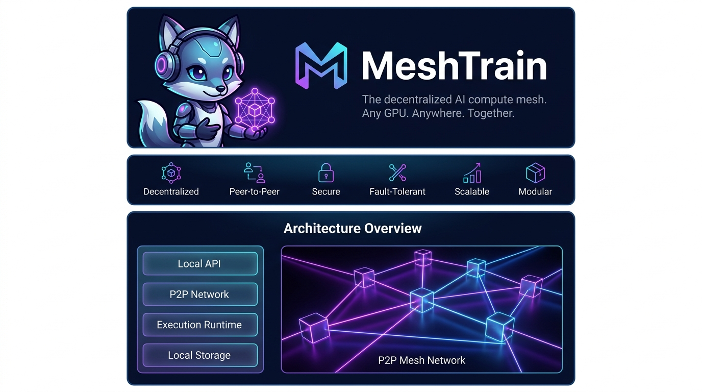

# MeshTrain: The Decentralized AI Compute Mesh

[](https://opensource.org/licenses/MIT)
[](https://www.python.org/downloads/)
[]()
[]()


Welcome to **MeshTrain**, a production-grade, zero-trust, peer-to-peer network designed to democratize AI compute. MeshTrain allows anyone to run or train massive AI models (like LLMs or Stable Diffusion) by dynamically borrowing GPU power from a global network of peers, creating a giant decentralized supercomputer.

## 📖 The "Real World" Analogy
Think of MeshTrain as **Airbnb for GPUs combined with BitTorrent**. 
If you have an old laptop and you want to generate a heavy Stable Diffusion image, you don't have the hardware for it. Meanwhile, someone in Tokyo is asleep with a massive RTX 4090 sitting idle. 
MeshTrain connects you directly to that idle GPU over an encrypted peer-to-peer network. Your prompt is sent to Tokyo, the image is generated, and streamed back to you. In return, the node in Tokyo automatically earns a "MeshCoin" on their local ledger. 

No central servers. No AWS bills. No corporate gatekeepers.

---

## 🛠️ The Tech Stack
Built for speed, security, and scalability.
- **Core App**: Python 3.10+
- **P2P Networking**: `py-libp2p` (Kademlia DHT, SECIO encryption, multiplexing)
- **AI Execution**: `transformers`, `peft` (LoRA), `diffusers` (Stable Diffusion)
- **Data Serialization**: `protobuf` (Protocol Buffers)
- **Economy**: Local `sqlite3` ledger
- **Desktop UI**: `Electron`, `FastAPI`, Vanilla HTML/CSS/JS (Glassmorphism design)

---

## 🧠 Data & Logic Flow: How it Works

When you run a command like `meshtrain infer gpt2 "The future is..."`, here is the exact lifecycle of what happens under the hood:

### 1. Peer Discovery (Kademlia DHT)
Your node starts up and reaches out to the **Global DHT (Distributed Hash Table)**. It asks the network: *"Who is currently online and providing MeshTrain compute services?"* The DHT responds with a list of encrypted PeerIDs and their IP addresses.

### 2. Hardware Capability Routing
Not all nodes are created equal. Your `JobPlanner` evaluates the remote nodes based on their advertised hardware capabilities. If you are generating text, it looks for nodes with at least 2GB of VRAM. If you are generating a heavy image, it filters for nodes with 8GB+ VRAM.

### 3. MeshDrive: P2P Data Distribution
If you are running a heavy LoRA fine-tuning job (MeshTune), you need to send a large `.jsonl` dataset to the worker node. Instead of uploading a huge file, MeshTrain uses **MeshDrive**. It breaks your dataset into tiny 5MB chunks, generates a cryptographic manifest, and pins those chunks to random peers on the network. The worker node dynamically downloads the chunks from the swarm, just like BitTorrent.

### 4. MeshProtect: The Security Sandbox
When the remote node receives your request, it doesn't just blindly run code. The Execution Engine is wrapped in **MeshProtect**—a strict Python `SecurityContext` that disables `trust_remote_code` and locks down the environment. This ensures malicious users cannot trick the network into running harmful scripts.

### 5. Proof of Compute & Consensus Verification
How do you know the remote node didn't just return garbage text to steal your MeshCoins? 
MeshTrain routes your prompt to **two different peers simultaneously**. When both results return, your local `ConsensusEngine` mathematically calculates their structural similarity using sequence matching algorithms. If the outputs match, the compute is mathematically verified!

### 6. Economy & MeshCoin
Once the compute is verified, your node's local SQLite `CreditLedger` cryptographically signs a receipt and credits the remote worker's account with a **MeshCoin**. (1 Coin for Inference, 50 Coins for Training).

---

## 🛡️ Security Architecture (Technical Deep Dive)

MeshTrain operates on a **Zero-Trust** philosophy. Because you are executing AI models from anonymous nodes across the internet, security is paramount:

1. **Encrypted Transport**: All peer-to-peer traffic is multiplexed and encrypted using `libp2p`'s native SECIO / TLS-like handshakes. Eavesdropping on dataset transmission is mathematically impossible.
2. **MeshProtect (Sandbox Execution)**: Loading a model in Python (via `transformers`) is notoriously dangerous because models can contain malicious pickled Python code. When a worker node receives a request, the `MeshNode` execution engine is wrapped in a `SecurityContext` that forcefully strips `trust_remote_code=True` at the environment level. Remote arbitrary code execution (RCE) is blocked.
3. **Consensus Verification (Proof of Compute)**: To prevent a malicious worker node from returning random garbage text to farm MeshCoins, the `InferenceRouter` utilizes a Dual-Routing protocol. It sends the prompt to Node A and Node B. The local `ConsensusEngine` mathematically analyzes the structural similarity of the two responses using `difflib.SequenceMatcher`. If the threshold drops below 85%, the results are rejected, the nodes are flagged, and no MeshCoins are minted.

---

## 🤝 Contributing Guide

We welcome contributions from the community! To get started:

1. **Fork and Clone**:
   ```bash
   git clone https://github.com/Santhoshnadella/MESHTRAIN.git
   cd MESHTRAIN
   ```
2. **Set up a Virtual Environment**:
   ```bash
   python -m venv .venv
   source .venv/bin/activate  # On Windows: .venv\Scripts\activate
   pip install -e .
   ```
3. **Make your Changes**: Create a new branch (`git checkout -b feature/amazing-idea`).
4. **Commit your Code**:
   - Write clear, descriptive commit messages.
   - Example: `git commit -m "feat(security): enhance consensus algorithm threshold"`
5. **Push and Open a PR**:
   ```bash
   git push origin feature/amazing-idea
   ```
   Head to GitHub and open a Pull Request. We review all PRs within 48 hours!

---

## 📂 Developer Folder Structure

If you want to contribute, here is how the codebase is organized:
```text
meshtrain/
├── meshtrain/
│   ├── cli/            # CLI commands (start, infer, tune, balance, ui)
│   ├── network/        # libp2p Host, Kademlia DHT, and Protocol Handlers
│   ├── inference/      # InferenceRouter & ConsensusEngine
│   ├── finetuning/     # LoRATuner for parameter-efficient distributed training
│   ├── storage/        # ContentStore (MeshDrive) for chunking datasets
│   ├── security/       # MeshProtect SecurityContext Sandbox
│   ├── economy/        # SQLite CreditLedger for MeshCoin tracking
│   ├── node/           # MeshNode local AI runtime (Transformers/Diffusers)
│   └── ui/             # FastAPI backend & Premium Electron Desktop App
├── protocols/          # .proto schema definitions (Node, Inference, Training, Storage)
└── pyproject.toml      # Dependency management
```

---

## 🚀 Quick Start Guide

### Prerequisites
- Python 3.10+
- Node.js (for the Electron UI)
- `pip install -r requirements.txt` (or install via poetry/pipenv)

### Launching the Premium Desktop App
MeshTrain comes with a stunning, native desktop interface powered by Electron and a FastAPI Python backend.

```bash
# From the root directory:
meshtrain ui
```
This will automatically boot the local P2P network bridge on port 8000 and open the native window. You can check your MeshCoin balance, see connected peers, and run Text/Image generations right from the GUI!

### Using the CLI
If you prefer the terminal, MeshTrain provides a powerful command-line interface:

**Start a passive worker node (Earn MeshCoins):**
```bash
meshtrain start --port 8001
```

**Check your earned balance:**
```bash
meshtrain balance
```

**Run Decentralized Inference (Consensus Verified):**
```bash
meshtrain infer gpt2 "Decentralized AI is" 
```

**Run Multi-Modal Image Generation:**
```bash
meshtrain infer stable-diffusion-v1-5 "A cyberpunk city at night" --modality image
```

**Run Decentralized LoRA Fine-Tuning:**
```bash
meshtrain tune gpt2 my_dataset.jsonl
```

---

## 📊 Project Status & Progress

MeshTrain is being built in structured phases. Here is the current progress:

### ✅ Ready to Use (Completed)
- **V0-V5 (Foundations & Networking)**: Kademlia DHT, `libp2p` secure encrypted streams, auto-reconnects, and hardware benchmarking.
- **V6 (MeshTune)**: Distributed LoRA fine-tuning utilizing HuggingFace `peft`. Remote nodes train adapters and stream the binary weights back over the network.
- **V7 (MeshDrive)**: Content-addressed storage for chunking and replicating datasets across the P2P swarm.
- **V8 (Proof of Compute)**: `ConsensusEngine` that dual-routes jobs and verifies similarity to prevent fraud.
- **V9 (Tokenomics)**: Internal SQLite `CreditLedger` for issuing and tracking MeshCoins.
- **V10 (Multi-Modal)**: Binary payload streaming to support `diffusers` image generation alongside text.
- **V11 (MeshProtect)**: Sandbox environment locking down `transformers` execution.
- **V12 (Premium UI)**: Native Electron desktop application with a FastAPI bridge.
- **V13 (Federated Learning)**: `FederatedAverager` for simultaneously training across multi-node swarms and merging LoRA weights using FedAvg.
- **V14 (NAT Traversal)**: Implemented AutoNAT and Circuit Relay V2 for bypassing strict enterprise firewalls.
- **V15 (Containerization)**: Complete Docker swarm deployment and packaging as a global `pip` library.

### ⏳ Still Pending (Future Roadmap)
- **True Blockchain Integration**: Currently, MeshCoins are tracked locally via receipts. The next step is tying the `CreditLedger` to a real Solana or Ethereum smart contract for real-world financial incentives.
